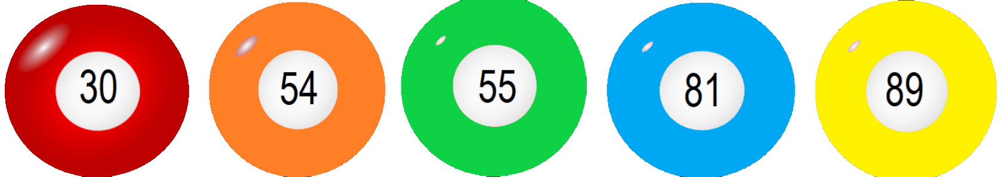

# ikt-csoport-munka
<body>
    <header>
        <h1>Lottó</h1>
        <ul>
            <li>Korábbi sorsolások</li>
            <li>Leggyakoribb számok</li>
            <li>Leghasonlóbb számsorok</li>
            <li>Leghosszabb sorozatok számsorokban</li>
            <li>Legkisebb összegű számsorok</li>
            <li>Grafikonok</li>
            <li>Érdekes történetek</li>
        </ul>
    </header>
            <h1>Korábbi sorsolások</h1>
            <h2>Az előző heti nyerőszámok</h2>
            
            <h2>A múlt heti nyerőszámok</h2>
            
</body>